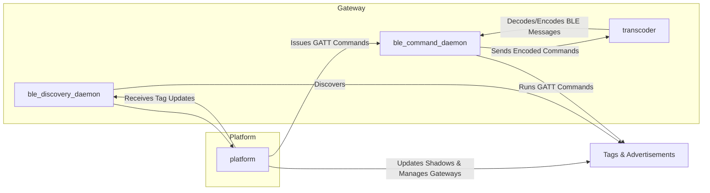

# Infrastructure
## Explaination of the different services:
### Gateway services:
* ble_discovery_daemon: Discovers tags and their advertisements, then forwards this information to the platform.
* ble_command_daemon: Executes GATT commands on tags based on instructions from the platform.
* transcoder: Encodes and decodes BLE messages for reliable communication between the ble_command_daemon and tags.

### Platform service:
Centralized api that manages tag shadows and gateways, sending GATT commands to ble_command_daemon and receiving tag updates from ble_discovery_daemon.

### Interaction:
The Platform orchestrates the entire system, instructing gateways and maintaining the state of tags and gateways.
The transcoder acts as a utility for communication encoding/decoding on the gateway.

## Messages:
Messages to tags are sent to the MQTT-channels. They will be processed by the current gateway that is bound to a tag. If no gateway is bound to the tag, they will be helt in the shadows queue until the tag connects to a gateway.