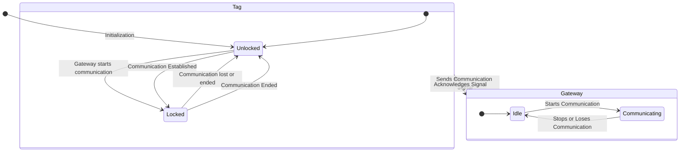
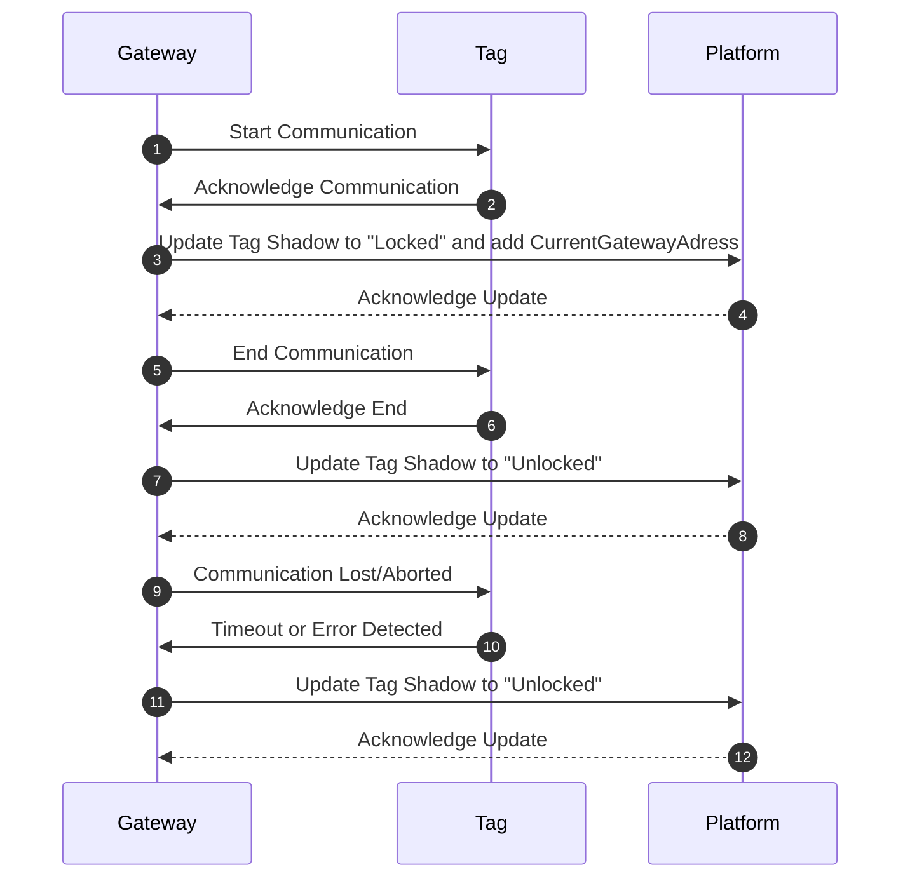
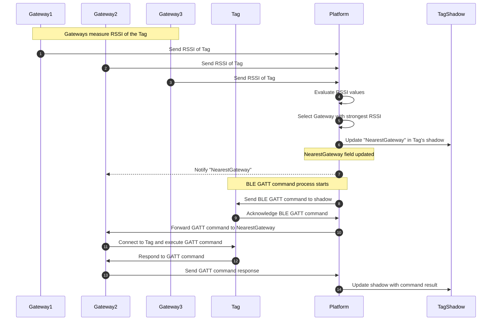

# Handling roaming locking state
## Gateway-local statemachine
Gateways have to implement a state machine where they store their communication state for each tag. As we cannot connect to a tag that is bound in communication, we have to wait for it to leave the communication to be able to perform roaming actions.

## Platform-managed shadow states
Shadows implement a field where they store their communication state. As we cannot connect to a tag that is bound in communication, we have to wait for it to leave the communication to be able to perform roaming actions.

## Roaming management
Roaming is handled by sorting a list of gateways by their RSSI-values for each tagshadow and storing the one with the highest RSSI to the field NearestGateway.
