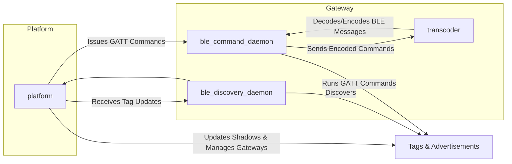
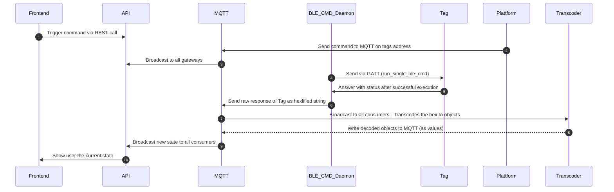

# Infrastructure

## Repository structure

* root
  * frontend: Angular frontend with docs
  * ble-daemon: Command and discovery services
  * deployments: docker-compose deployments
  * docs: symlink to frontend/public/docs
  * gateway: Library with general functions, like tag-objects, sensor-objects etc.
  * api: Web-API, including business logic
  * transcoder: Transcodes all messages, encoding is used as a library in platform

## Key principles

The whole cluster is completely stateless. This means, that no state is stored at any time, nor is it necessary to know the clusters state to perform any interaction with any object. Objects do not know their own state, unless they were asked for it. This means all data in the cluster is only available on transit.  
The benefit is that the scope of complexity is bound to only one function at a time. If you require persistence, it can be implemented by tieing a database to MQTT, that records all messages on the fly. A timeseries database should be suited best for this kind of recording.
The principles of this software design are:
* no data records
* clear attribution (one service should only perform one task in the coreography)
* seperation between low- and high-level operation

## Explaination of the different services:

### Gateway services:

* ble_discovery_daemon: Discovers tags and their advertisements, then forwards this information to the platform.
* ble_command_daemon: Executes GATT commands on tags based on instructions from the platform.

### Platform services:

Centralized api that manages tag shadows and gateways, sending GATT commands to ble_command_daemon and receiving tag updates from ble_discovery_daemon.
* api: handles user input and presents data to the users
* transcoder: Encodes and decodes BLE messages for reliable communication between the ble_command_daemon and tags.

### Interaction:

The Platform orchestrates the entire system, instructing gateways and maintaining the state of tags and gateways.
The transcoder acts as a utility for communication encoding/decoding on the gateway.

## Messages:

Messages to tags are sent to the MQTT-channels. They will be processed by the current gateway that is bound to a tag. If no gateway is bound to the tag, they will be held in the shadows queue until the tag connects to a gateway.

## Example - Writing a config:

This example shows, how a set config is executed to the tag. It is a good representation of what to expect.

